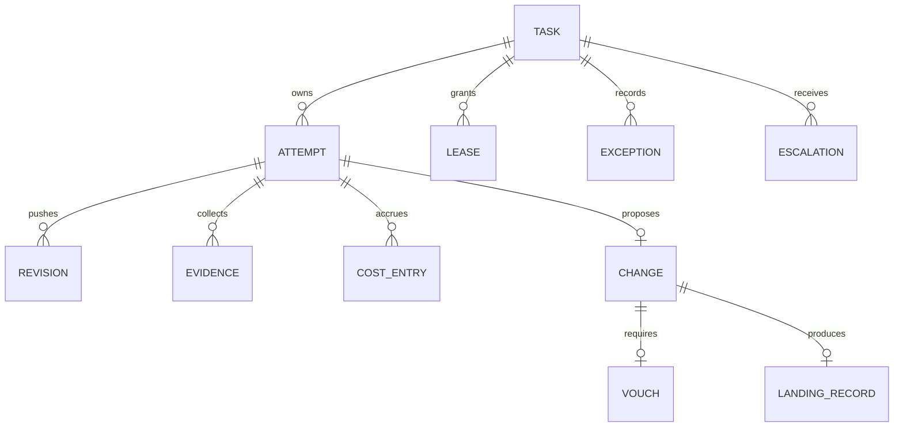
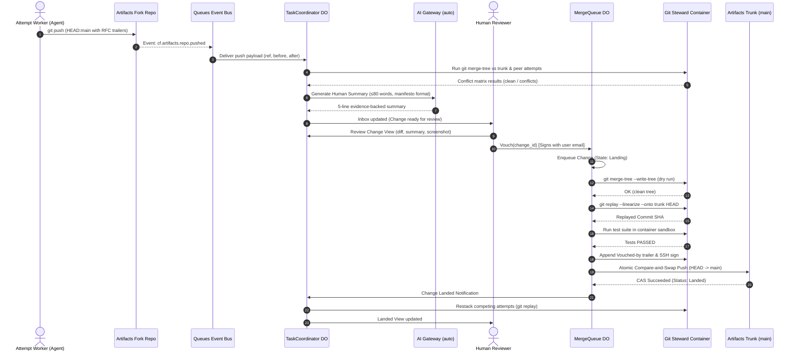

# Project Berth: System Architecture Specification

> **Binding Reference:** [MANIFESTO.md](file:///C:/Users/richa/dev/berth/MANIFESTO.md) and [TARGETS.md](file:///C:/Users/richa/dev/berth/TARGETS.md).  
> **Core Principle:** "Agents write the code. Humans decide what lands."

---

## 1. System Topology & Component Overview

Berth is an agent-native Git platform implemented entirely on Cloudflare's serverless edge and container fabric. It replaces human-to-human PR bureaucracy with a coordinator-driven, attempt-racing engine backed by linear Git history.

```mermaid
flowchart TD
    subgraph Clients["Agents & Humans"]
        AG[Agy / Autonomous Agents]
        HUMAN[Human Reviewer / Voucher]
    end

    subgraph Edge["Cloudflare Workers & Control Plane"]
        ROUTER[Edge Router & Auth Worker]
        MCP_SRV[Berth MCP Server Worker]
        UI[Workers Static Assets - 4 Views]
        AIG[AI Gateway - cloudflare/auto]
        QUEUES[Cloudflare Queues - Push Event Bus]
    end

    subgraph DurableObjects["Cloudflare Durable Objects"]
        TC[TaskCoordinator DO<br/>(One per Task, SQLite)]
        MQ[MergeQueue DO<br/>(Singleton, Trunk Write Token)]
    end

    subgraph Compute["Cloudflare Containers (durable_object policy)"]
        GS_CONT[Git Steward Container<br/>(Git 2.56, merge-tree, replay)]
        ATT_CONT[Attempt Sandbox Container<br/>(Egress secret:// injection)]
    end

    subgraph Storage["Cloudflare Storage & Git"]
        ART_TRUNK[Artifacts Repo: berth main]
        ART_FORKS[Artifacts Repo Forks: berth-task-N-att-M]
        R2_SESS[R2: Session Context & Transcripts]
        GH_MIRROR[GitHub Public Mirror]
    end

    AG -->|MCP JSON-RPC / SSE| MCP_SRV
    AG -->|Git Smart HTTP Push| ART_FORKS
    HUMAN -->|HTTPS / CF Access| UI
    UI -->|RPC / WebSocket| TC
    UI -->|Vouch RPC| MQ

    MCP_SRV -->|DO RPC| TC
    ROUTER -->|Webhook / Issues| TC

    TC -->|Spawn Fork| ART_FORKS
    TC -->|ctx.container| ATT_CONT
    ATT_CONT -->|Intercepted Egress| AIG

    ART_FORKS -->|cf.artifacts.repo.pushed| QUEUES
    QUEUES -->|Push Notification| TC
    TC -->|Invoke git plumbing| GS_CONT

    MQ -->|Merge check & Replay| GS_CONT
    MQ -->|Atomic CAS Push| ART_TRUNK
    ART_TRUNK -->|Mirror Push Event| GH_MIRROR
```

---

## 2. Core Data Model

All transactional state lives in the SQLite database embedded within each Durable Object instance (`ctx.storage.sql`).



### Entity Schemas

#### 1. `Task`
The fundamental unit of user intent.
```sql
CREATE TABLE tasks (
    task_id TEXT PRIMARY KEY,
    title TEXT NOT NULL,
    intent TEXT NOT NULL,
    status TEXT NOT NULL CHECK(status IN ('Intent', 'Exploring', 'Proposed', 'Vouched', 'Landing', 'Landed', 'Escalated')),
    owner_email TEXT NOT NULL,
    budget_usd REAL NOT NULL DEFAULT 5.00,
    spent_usd REAL NOT NULL DEFAULT 0.00,
    created_at INTEGER NOT NULL,
    updated_at INTEGER NOT NULL
);
```

#### 2. `Attempt`
One agent's isolated trial in its own fork and sandbox.
```sql
CREATE TABLE attempts (
    attempt_id TEXT PRIMARY KEY,
    task_id TEXT NOT NULL REFERENCES tasks(task_id),
    agent_id TEXT NOT NULL,
    fork_repo_name TEXT NOT NULL,
    fork_remote_url TEXT NOT NULL,
    container_instance_id TEXT,
    status TEXT NOT NULL CHECK(status IN ('starting', 'active', 'proposed', 'stopped', 'landed', 'discarded')),
    stop_reason TEXT,
    head_sha TEXT,
    created_at INTEGER NOT NULL,
    updated_at INTEGER NOT NULL
);
```

#### 3. `Lease`
Path-level mutual exclusion preventing uncoordinated collision.
```sql
CREATE TABLE leases (
    lease_id TEXT PRIMARY KEY,
    task_id TEXT NOT NULL REFERENCES tasks(task_id),
    attempt_id TEXT NOT NULL REFERENCES attempts(attempt_id),
    path_pattern TEXT NOT NULL,
    granted_at INTEGER NOT NULL,
    expires_at INTEGER NOT NULL
);
```

#### 4. `Change` & `Revision`
A persistent unit of proposed behavior that maintains identity (`Change-Id`) across rebase and linearization.
```sql
CREATE TABLE changes (
    change_id TEXT PRIMARY KEY, /* Extracted from Change-Id: trailer */
    task_id TEXT NOT NULL REFERENCES tasks(task_id),
    attempt_id TEXT NOT NULL REFERENCES attempts(attempt_id),
    patch_id TEXT NOT NULL,     /* Generated via git patch-id for review caching */
    status TEXT NOT NULL CHECK(status IN ('Draft', 'Proposed', 'Vouched', 'Landed', 'Abandoned')),
    summary_why TEXT NOT NULL,
    summary_what TEXT NOT NULL,
    summary_look_at TEXT NOT NULL,
    summary_verified TEXT NOT NULL,
    summary_not_verified TEXT NOT NULL, /* Mandatory manifesto field */
    total_cost_usd REAL NOT NULL,
    created_at INTEGER NOT NULL
);

CREATE TABLE revisions (
    revision_id TEXT PRIMARY KEY,
    change_id TEXT NOT NULL REFERENCES changes(change_id),
    commit_sha TEXT NOT NULL,
    tree_sha TEXT NOT NULL,
    pushed_at INTEGER NOT NULL
);
```

#### 5. `Evidence`
Strict proof attached to claims (tests, reproductions, screenshots).
```sql
CREATE TABLE evidence (
    evidence_id TEXT PRIMARY KEY,
    attempt_id TEXT NOT NULL REFERENCES attempts(attempt_id),
    type TEXT NOT NULL CHECK(type IN ('test_run', 'kitesurf_screenshot', 'reproduction', 'symbol_graph')),
    description TEXT NOT NULL,
    artifact_url TEXT NOT NULL, /* R2 link or Artifacts blob ref */
    verified_at INTEGER NOT NULL
);
```

#### 6. `Vouch`
A named human taking personal responsibility for a change landing on trunk.
```sql
CREATE TABLE vouches (
    vouch_id TEXT PRIMARY KEY,
    change_id TEXT NOT NULL UNIQUE REFERENCES changes(change_id),
    human_name TEXT NOT NULL,
    human_email TEXT NOT NULL,
    vouched_at INTEGER NOT NULL,
    statement TEXT NOT NULL
);
```

#### 7. `Exception`
Explicitly logged deviations from manifesto rules.
```sql
CREATE TABLE exceptions (
    exception_id TEXT PRIMARY KEY,
    task_id TEXT REFERENCES tasks(task_id),
    rule_broken TEXT NOT NULL,
    reason TEXT NOT NULL,
    actor TEXT NOT NULL,
    logged_at INTEGER NOT NULL
);
```

---

## 3. Durable Object Responsibilities

### 1. `TaskCoordinator` (One DO Per Task)
- **Role:** Central orchestrator for a single unit of intent.
- **State:** Backed by SQLite. Holds attempts, leases, budget spend, decision log, conflict matrix, and active escalations.
- **Lifecycle Management:**
  - On task creation: Initializes budget, assigns human owner.
  - On attempt claim: Mints Artifacts fork via `env.ARTIFACTS.get("berth").fork(...)`, spins up sandbox container via `this.ctx.container.start(...)`.
  - Lease arbitrator: Grants or rejects path leases (`request_lease`).
  - Budget watchdog: Ingests cost events; invokes `this.ctx.container.destroy()` if an attempt exceeds threshold.
  - Decision logger: Records every state transition (e.g., "Attempt 3 stopped: path lease collision").
  - Push receiver: Receives push event from Queue, runs `git merge-tree` to refresh conflict matrix.

### 2. `MergeQueue` (Singleton Durable Object)
- **Role:** Sole custodian of the repository's trunk (`main`).
- **Security Invariant:** Holds the **only** write-scoped token for `berth` trunk in the entire Cloudflare account.
- **Responsibilities:**
  - Maintains FIFO queue of changes in `Vouched` state.
  - Controls Git Steward Container to execute pre-flight merge checks (`git merge-tree`).
  - Flattens commit history with `git replay --linearize`.
  - Spins up ephemeral test container to verify linearized tree.
  - Appends `Vouched-by:` trailer and signs commit with Queue SSH private key.
  - Executes compare-and-swap ref update on Artifacts `main`.
  - Triggers automatic restack of competing open attempts.

---

## 4. MCP Tool Schemas (Model Context Protocol)

Agents interact with Berth exclusively through the standard MCP interface exposed by the Berth MCP Worker.

### 1. `claim_task`
Claims an available task and provisions an isolated attempt workspace.
```json
{
  "name": "claim_task",
  "description": "Claim an open task to work on. Provisions a dedicated Artifacts fork and sandbox.",
  "parameters": {
    "type": "object",
    "properties": {
      "task_id": { "type": "string", "description": "The unique task identifier" },
      "agent_name": { "type": "string", "description": "Name or identifier of the claiming agent" }
    },
    "required": ["task_id", "agent_name"]
  }
}
```
*Returns:* `{ "attempt_id": "...", "fork_remote": "...", "token": "...", "budget_remaining_usd": 4.50 }`

### 2. `get_context_pack`
Retrieves task intent, leased files, trunk HEAD, and relevant session notes.
```json
{
  "name": "get_context_pack",
  "description": "Fetches task intent, active leases, trunk state, and prior attempt notes.",
  "parameters": {
    "type": "object",
    "properties": {
      "attempt_id": { "type": "string", "description": "The active attempt identifier" }
    },
    "required": ["attempt_id"]
  }
}
```

### 3. `request_lease`
Requests exclusive lease on file path patterns to avoid merge conflicts.
```json
{
  "name": "request_lease",
  "description": "Request a temporary exclusive lease on file path patterns.",
  "parameters": {
    "type": "object",
    "properties": {
      "attempt_id": { "type": "string", "description": "The active attempt identifier" },
      "paths": { 
        "type": "array", 
        "items": { "type": "string" },
        "description": "File paths or glob patterns (e.g. 'src/auth/**')" 
      },
      "duration_seconds": { "type": "integer", "default": 1800 }
    },
    "required": ["attempt_id", "paths"]
  }
}
```

### 4. `propose`
Proposes an attempt's commit for human review with verified evidence.
```json
{
  "name": "propose",
  "description": "Propose the current attempt as a candidate change to land on trunk.",
  "parameters": {
    "type": "object",
    "properties": {
      "attempt_id": { "type": "string" },
      "commit_sha": { "type": "string", "description": "The commit SHA in the attempt's fork" },
      "evidence_ids": { 
        "type": "array", 
        "items": { "type": "string" },
        "description": "List of evidence IDs verifying this change" 
      }
    },
    "required": ["attempt_id", "commit_sha", "evidence_ids"]
  }
}
```

### 5. `escalate`
Halts execution and asks a human a single, targeted question.
```json
{
  "name": "escalate",
  "description": "Escalate to a human when blocked. Never guess on product or architectural decisions.",
  "parameters": {
    "type": "object",
    "properties": {
      "attempt_id": { "type": "string" },
      "question": { "type": "string", "description": "Specific question for the human owner" },
      "options": {
        "type": "array",
        "items": { "type": "string" },
        "description": "Optional list of distinct alternatives considered"
      }
    },
    "required": ["attempt_id", "question"]
  }
}
```

### 6. `report_cost`
Reports model tokens and estimated inference cost accrued by the agent.
```json
{
  "name": "report_cost",
  "description": "Report incremental token usage and inference cost.",
  "parameters": {
    "type": "object",
    "properties": {
      "attempt_id": { "type": "string" },
      "tokens_in": { "type": "integer" },
      "tokens_out": { "type": "integer" },
      "cost_usd": { "type": "number" },
      "model": { "type": "string" }
    },
    "required": ["attempt_id", "cost_usd"]
  }
}
```

### 7. `report_friction`
Logs platform bugs or obstacles directly into the friction backlog.
```json
{
  "name": "report_friction",
  "description": "Report friction when the platform gets in the way. Never route around platform bugs silently.",
  "parameters": {
    "type": "object",
    "properties": {
      "attempt_id": { "type": "string" },
      "obstacle": { "type": "string", "description": "What failed or caused friction" },
      "command_or_tool": { "type": "string" },
      "suggested_fix": { "type": "string" }
    },
    "required": ["attempt_id", "obstacle"]
  }
}
```

---

## 5. Event Flow: From Push to Landed



---

## 6. The Landing Algorithm

The landing sequence is strictly linear and transactional. Merges to trunk never produce merge commits (`git log --merges` on trunk returns 0).

```
1. Fetch Trunk HEAD:
   let trunk_sha = Artifacts.get("berth").info().defaultBranchSha

2. In-Memory Conflict Detection:
   let tree = git merge-tree --write-tree trunk_sha attempt_sha
   if tree.exit_code != 0:
       abort("Merge conflict detected against trunk HEAD", tree.conflicts)

3. Linearization via Server-side Replay:
   let linearized_commits = git replay --linearize --onto trunk_sha attempt_sha
   if linearized_commits.failed:
       abort("Replay failed", linearized_commits.error)

4. Automated Pre-Flight Verification:
   Boot ephemeral container with linearized tree
   Run configured test runner (pnpm test)
   if test_status != 0:
       abort("Verification failed on linearized tree", test_output)

5. Provenance & Signing:
   Append trailer: "Vouched-by: <Voucher Name> <voucher@example.com>"
   Sign final commit with Queue Ed25519 SSH private key

6. Compare-And-Swap (CAS) Ref Update:
   Execute atomic push:
   git push --force-with-lease=refs/heads/main:trunk_sha origin linearized_head:refs/heads/main
   
   if push succeeds:
       Mark Change Landed
       Trigger Background Restack of all open peer attempts
       return SUCCESS
   else (Trunk moved during test / CAS race):
       log("CAS contention: trunk advanced. Retrying landing loop...")
       retry loop up to 3 times
       if retries exhausted:
           requeue Change at head of queue
```

---

## 7. Git Feature Architecture Matrix

| Git Feature | Version Required | Where It Is Used in Berth | Why It Is Critical |
|---|---|---|---|
| `git merge-tree --write-tree` | Git ≥ 2.40 | Git Steward Container / `TaskCoordinator` | Evaluates merge conflicts server-side without needing a working tree or checking out files. |
| `git replay --linearize` | **Git ≥ 2.56** | Git Steward Container / `MergeQueue` | Flattens commit graphs in memory, stripping merge commits and generating clean linear history server-side. |
| `git add --resolved` | **Git ≥ 2.56** | Attempt Sandboxes / Hooks | Guards commit staging by checking for leftover conflict markers (`<<<<<<<`). Aborts if markers remain. |
| `git range-diff` | Git ≥ 2.19 | Change View / Revision Inspector | Shows reviewers exactly what changed between two revisions of a rebased change, eliminating re-review fatigue. |
| `git patch-id` | Git Standard | Control Plane / Review Cache | Computes stable patch fingerprint. If restacking a change yields identical patch-id, prior review evidence is preserved. |
| `git notes` (`refs/notes/*`) | Git Standard | Artifacts Git Server & Control Plane | Stores full agent session logs, reasoning traces, and cost metadata attached to commits without polluting commit messages. |
| `git bisect --reset-when-found` | **Git ≥ 2.56** | Issue-to-Task Autonomous Regression Hunter | Automatically bisects regressions in background container and cleanly resets repository state upon identifying the culprit commit. |
| `git branch --delete-merged` | **Git ≥ 2.56** | Git Steward Maintenance Worker | Prunes and cleans up temporary landing branches and restacked refs cleanly. |
| **SSH Commit Signing** | Git Standard | Attempt Sandboxes & `MergeQueue` | Every agent signs with an ephemeral attempt SSH key; `MergeQueue` signs final landed commit with Queue key for verified provenance. |
