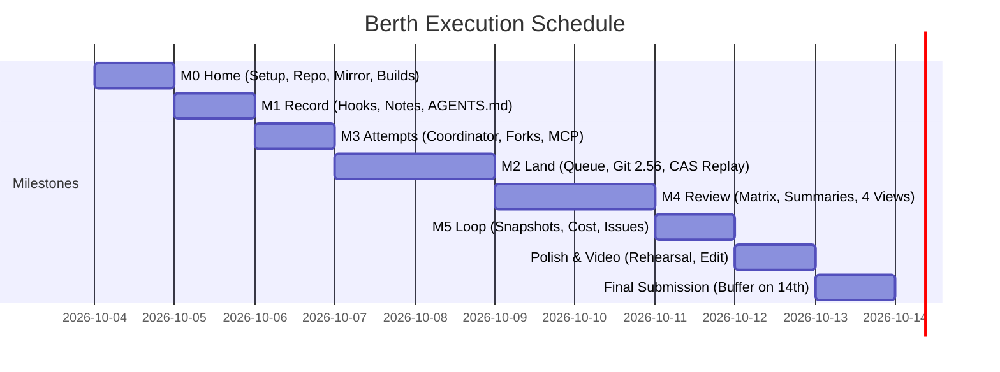

# Project Berth: Implementation & Milestone Plan

> **Binding Reference Documents:** [MANIFESTO.md](file:///C:/Users/richa/dev/berth/MANIFESTO.md) and [TARGETS.md](file:///C:/Users/richa/dev/berth/TARGETS.md).  
> **Target Submission Date:** Tuesday 13 October 2026 (Competition deadline: Wednesday 14 October 2026).  
> **Customer Zero Commitment:** Berth is built on itself from Day 1. Every milestone switches on a dogfooding rule.

---

## 1. Milestones Overview

| Milestone | Target Date | Dogfooding Rule Switched On | Core Deliverables |
|---|---|---|---|
| **M0 Home** | Sun 4 Oct (Day 1) | *All code lives in Artifacts* | Artifacts repo `berth`, bidirectional GitHub mirror Worker, Workers Builds deployment on `main`, initial CI pipeline. |
| **M1 Record** | Mon 5 Oct (Day 2) | *Every commit names its session* | Agy lifecycle hook enforcing `Task:`, `Attempt:`, `Session:`, and `Change-Id:` trailers; session context upload to R2/Artifacts; AGENTS.md rules. |
| **M3 Attempts** | Tue 6 Oct (Day 3) | *All work starts as a task* | Coordinator Durable Object (`TaskCoordinator`), disposable Artifacts forks per attempt, attempt container sandboxes via `ctx.container`, Berth MCP Server (`claim_task`, `request_lease`, `propose`, `escalate`, `report_cost`, `report_friction`). |
| **M2 Land** | Wed 7 Oct – Thu 8 Oct (Days 4–5) | *Nobody pushes to trunk* | Git Steward merge queue Worker & DO (`MergeQueue`), server-side merge verification (`git merge-tree`), linearization (`git replay --linearize`), automated container test runner, atomic compare-and-swap push to trunk, attempt restacking (`git replay`). |
| **M4 Review** | Fri 9 Oct – Sat 10 Oct (Days 6–7) | *Every platform change is vouched* | Real-time push conflict matrix across all open attempts via Queues (`cf.artifacts.repo.pushed`), manifesto-compliant human summary generator (≤80 words, mandatory "Not verified", cost breakdown), Cloudflare Access auth, four views: **Inbox**, **Task**, **Change**, **Landed**, and one-click Vouch action. |
| **M5 Close the Loop** | Sun 11 Oct (Day 8) | *The platform fixes its own production bugs* | Container snapshots (`snapshotContainer`) for ≤2s attempt boots, AI Gateway cost attribution (`cf-aig-metadata`), Cloudflare Observability Issues webhook auto-triaging production crashes into Tasks. |
| **Polish & Video** | Mon 12 Oct (Day 9) | *Demo rehearsal & recording* | Kitesurf screenshot evidence integration, customer-zero metrics compilation (tasks, attempts, cost, median review time), rehearsal of the 7-9 min demo video hitting all 8 demo moments. |
| **Submission** | Tue 13 Oct (Day 10) | *Final lock & mirror verification* | Final submission verification, public GitHub mirror check, MIT licence confirmation, submission to Cloudflare portal. (Wed 14 Oct is buffer). |

*(Note on milestone sequencing: M3 precedes M2 by design. The merge queue requires real parallel attempts to execute and restack.)*

---

## 2. Detailed Milestone Task Breakdown

### Milestone M0: Home (Target: Sun 4 Oct)
*Dogfooding rule: All code lives in Artifacts.*

#### Task M0.1: Local Toolchain & Cloudflare Foundation Setup
- **Owner Agent:** `architect`
- **Dependencies:** None
- **Estimate:** 1.5 hours
- **Description:** Install and verify `cf` CLI (`npm install -g cf`), `wrangler@latest` (≥4.145.0), and initialize project workspace `berth` with TypeScript, pnpm workspace, and `wrangler.jsonc`.
- **Acceptance Criteria:**
  1. `cf --version` and `wrangler --version` execute successfully in workspace.
  2. Cloudflare authentication confirmed via `cf auth login` / API tokens with Artifacts, Workers, Containers, and Queues scopes.
  3. Base `wrangler.jsonc` configured with TypeScript and compatibility date `2026-10-01` or later.

#### Task M0.2: Artifacts Repository Provisioning & Remote Sync
- **Owner Agent:** `git-steward`
- **Dependencies:** M0.1
- **Estimate:** 2.0 hours
- **Description:** Create the primary repository `berth` in the default Artifacts namespace using the Workers binding/API (`env.ARTIFACTS.create("berth")` or `cf artifacts create berth`). Seed initial commit containing `MANIFESTO.md`, `TARGETS.md`, `README.md`, and license.
- **Acceptance Criteria:**
  1. Artifacts repo `berth` exists and returns remote URL: `https://<ACCOUNT_ID>.artifacts.cloudflare.net/git/default/berth.git`.
  2. Initial commit pushed via authenticated git-over-HTTPS using token minted by control plane.
  3. `git clone` from Artifacts remote succeeds cleanly over HTTPS.

#### Task M0.3: Bidirectional GitHub Mirror Worker & Break-Glass Logging
- **Owner Agent:** `git-steward`
- **Dependencies:** M0.2
- **Estimate:** 3.0 hours
- **Description:** Implement a sync Worker listening to Artifacts push events via Cloudflare Queues (`cf.artifacts.repo.pushed`) that mirrors commits on `main` to the public GitHub repository (`github.com/richa/berth`). Implement a break-glass sync mechanism that logs any external GitHub emergency push directly to an audit table in Durable Object storage with an explicit exception reason.
- **Acceptance Criteria:**
  1. A push to Artifacts `main` automatically replicates to GitHub `main` within 30 seconds.
  2. External pushes to GitHub generate an audit event warning and require an exception entry.
  3. Zero confidential session notes or unmasked secrets are leaked to the public mirror.

#### Task M0.4: Workers Builds CI/CD Pipeline
- **Owner Agent:** `architect`
- **Dependencies:** M0.2
- **Estimate:** 1.5 hours
- **Description:** Connect the Artifacts repository `berth` to Cloudflare Workers Builds. Configure build command (`pnpm run build`) and deploy command (`npx wrangler deploy`).
- **Acceptance Criteria:**
  1. Workers Builds triggers automatically on commit to Artifacts `main`.
  2. Control plane Worker deploys cleanly to Cloudflare edge.
  3. Production status dashboard confirms active deployment.

---

### Milestone M1: Record (Target: Mon 5 Oct)
*Dogfooding rule: Every commit names its session.*

#### Task M1.1: Antigravity Agent Lifecycle Hooks for Commit Trailers
- **Owner Agent:** `architect`
- **Dependencies:** M0.4
- **Estimate:** 2.5 hours
- **Description:** Implement `.agents/hooks.json` using `PreToolUse` (for `run_command` with git commit) or git commit hooks to automatically validate and append required RFC-2822 commit trailers: `Task:`, `Attempt:`, `Session:`, and `Change-Id:`.
- **Acceptance Criteria:**
  1. Any attempt commit without all 4 trailers is rejected or automatically decorated.
  2. `Change-Id` is consistently generated using standard Gerrit/Git hash algorithm (`git hash-object` over tree + parent + metadata).
  3. Commits staged with unresolved markers are blocked via `git add --resolved`.

#### Task M1.2: Session Context Pack Capture & Object Storage
- **Owner Agent:** `summariser`
- **Dependencies:** M1.1
- **Estimate:** 3.0 hours
- **Description:** Build the session capture mechanism. When an agent invocation completes, export the trajectory, reasoning tokens, and tool transcript to R2 (`berth-sessions/<task_id>/<attempt_id>/<session_id>.jsonl`) and attach a native git note to the commit under `refs/notes/agent-session`.
- **Acceptance Criteria:**
  1. `refs/notes/agent-session` exists and is pushable to Artifacts Git remote.
  2. Full transcript JSONL is uploaded to R2 and accessible via presigned link in control plane.
  3. `git notes show` displays valid session metadata without cluttering standard git commit log.

#### Task M1.3: Repo AGENTS.md Definition & Enforcement
- **Owner Agent:** `architect`
- **Dependencies:** M1.1
- **Estimate:** 1.5 hours
- **Description:** Generate `AGENTS.md` in repository root declaring the binding 10 Rules for Agents from `MANIFESTO.md`, defining test commands, lease boundaries, and secret placeholder rules (`secret://<name>`).
- **Acceptance Criteria:**
  1. `AGENTS.md` exists and is validated by agy on agent startup.
  2. Rules strictly forbid direct push to `main` and mandate MCP tool usage.

---

### Milestone M3: Attempts (Target: Tue 6 Oct)
*Dogfooding rule: All work starts as a task.*

#### Task M3.1: TaskCoordinator Durable Object Implementation
- **Owner Agent:** `architect`
- **Dependencies:** M1.3
- **Estimate:** 4.0 hours
- **Description:** Implement the `TaskCoordinator` class extending `DurableObject`. Implements SQLite storage (`ctx.storage.sql`) for task state machine (Intent, Exploring, Proposed, Vouched, Landing, Landed, Escalated), leases, attempt tracking, budget limits ($ per task, max model tokens), and decision logs.
- **Acceptance Criteria:**
  1. `TaskCoordinator` correctly transitions across all 7 lifecycle states.
  2. Enforces mutual exclusion on path leases (e.g., attempt 1 leased `src/auth`, attempt 2 is denied or warned).
  3. Tracks cumulative cost per attempt and terminates attempts exceeding budget.
  4. Decision log records every coordinator choice (e.g., "Aborted attempt 3: over budget").

#### Task M3.2: Disposable Fork Lifecycle Management
- **Owner Agent:** `git-steward`
- **Dependencies:** M3.1
- **Estimate:** 2.5 hours
- **Description:** Implement fork provisioning on task claim. Call `repo.fork("berth-task-<id>-att-<n>", { defaultBranchOnly: true })` using the Artifacts binding. Mint disposable write tokens (`repo.createToken("write", 7200)`) scoped strictly to the attempt's fork.
- **Acceptance Criteria:**
  1. Coordinator spawns at least 3 isolated Artifacts forks concurrently in <500ms.
  2. Each attempt receives a disposable write token that has zero write permissions on `berth` trunk.
  3. Fork deletion/cleanup operates cleanly after task resolution.

#### Task M3.3: Attempt Worker Container Sandbox Execution
- **Owner Agent:** `git-steward`
- **Dependencies:** M3.2
- **Estimate:** 4.0 hours
- **Description:** Implement container management inside DO using `ctx.container.start({ image: "berth-container", instance: "standard-1", enableInternet: false })`. Setup network egress proxy via `interceptOutboundHttp` / `interceptOutboundHttps` to inject credentials for `secret://` placeholders and forward model requests to AI Gateway.
- **Acceptance Criteria:**
  1. Container boots inside DO with git repo pre-cloned via token.
  2. Raw secrets are never visible inside the container environment.
  3. Outbound HTTPS traffic outside allowlist is blocked; AI Gateway calls succeed with injected keys.

#### Task M3.4: Berth MCP Server Worker Implementation
- **Owner Agent:** `architect`
- **Dependencies:** M3.1, M3.3
- **Estimate:** 3.5 hours
- **Description:** Implement MCP Server (SSE and Stdio endpoints) exposing tools: `claim_task`, `get_context_pack`, `request_lease`, `propose`, `escalate`, `report_cost`, `report_friction`. Authenticate callers via attempt tokens.
- **Acceptance Criteria:**
  1. External agy agent connects to Berth MCP server and lists tools.
  2. Tool invocations route directly to the target `TaskCoordinator` DO instance.
  3. Concurrent claims across 3 agents result in 3 independent attempt workspaces.

---

### Milestone M2: Land (Target: Wed 7 Oct – Thu 8 Oct)
*Dogfooding rule: Nobody pushes to trunk.*

#### Task M2.1: MergeQueue Durable Object Architecture
- **Owner Agent:** `git-steward`
- **Dependencies:** M3.4
- **Estimate:** 3.5 hours
- **Description:** Implement the singleton `MergeQueue` DO holding the exclusive write token for `berth` trunk (`main`). Manages an in-memory and SQLite-backed FIFO queue of vouched changes awaiting linearization and testing.
- **Acceptance Criteria:**
  1. Only `MergeQueue` holds write token to `main`; all direct pushes to `main` reject with HTTP 403.
  2. Queue processes proposed changes sequentially with state persistence.
  3. Audit log tracks exact queue transit timings.

#### Task M2.2: Git 2.56 Containerized Plumber Service
- **Owner Agent:** `git-steward`
- **Dependencies:** M2.1
- **Estimate:** 4.0 hours
- **Description:** Build specialized container image `berth-git-steward` containing Git 2.56 compiled from source. Expose plumbing RPCs to DO:
  - `mergeTreeCheck(baseSha, attemptSha)` via `git merge-tree --write-tree`
  - `linearizeReplay(baseSha, attemptSha)` via `git replay --linearize --onto baseSha`
  - `testRunner(headSha)` executing test suite in container.
- **Acceptance Criteria:**
  1. `git --version` inside container outputs `git version 2.56.x`.
  2. `git merge-tree --write-tree` executes without working tree and detects clean vs conflicting trees in <200ms.
  3. `git replay --linearize` successfully drops merge commits and produces linear commit list.

#### Task M2.3: CAS Atomic Landing Loop & Restacking
- **Owner Agent:** `git-steward`
- **Dependencies:** M2.2
- **Estimate:** 4.0 hours
- **Description:** Implement landing sequence:
  1. Run `merge-tree` against current trunk `HEAD`.
  2. Run `git replay --linearize` onto `HEAD`.
  3. Execute automated test container.
  4. Append `Vouched-by: <Name> <email>` trailer and sign with Queue SSH key.
  5. Execute atomic compare-and-swap ref update (`git push --force-with-lease` or `git update-ref` via Artifacts API).
  6. If trunk moved (CAS failure), retry loop up to 3 times.
  7. On success, trigger restacking of other open attempts using `git replay`.
- **Acceptance Criteria:**
  1. 100% of landed commits form clean linear history on `main` (0 merge commits).
  2. CAS failure gracefully retries and lands without human intervention.
  3. Open competing attempts are automatically restacked or flagged with conflict markers.

---

### Milestone M4: Review (Target: Fri 9 Oct – Sat 10 Oct)
*Dogfooding rule: Every platform change is vouched.*

#### Task M4.1: Real-time Push Conflict Matrix Engine
- **Owner Agent:** `git-steward`
- **Dependencies:** M2.3
- **Estimate:** 3.5 hours
- **Description:** Wire Artifacts push queue consumer (`cf.artifacts.repo.pushed`). When an attempt pushes to its fork, calculate conflict matrix: compare attempt `HEAD` against `main` and against all other active attempts for the task using `git merge-tree`. Persist matrix in `TaskCoordinator`.
- **Acceptance Criteria:**
  1. Median conflict matrix update latency ≤ 60 seconds from push event.
  2. Identifies file-level and hunk-level collisions across concurrent attempts.
  3. Broadcasts matrix update via WebSockets to connected UIs.

#### Task M4.2: Human Summary Generator (Manifesto Compliant)
- **Owner Agent:** `summariser`
- **Dependencies:** M4.1
- **Estimate:** 3.0 hours
- **Description:** Implement worker calling AI Gateway Auto Router (`cloudflare/auto`) with diff and test evidence. Enforce strict 5-line manifesto template (Why, What changes, Look at, Verified, Cost), maximum 80 words, and mandatory "Not verified" line.
- **Acceptance Criteria:**
  1. 100% of generated summaries are ≤ 80 words.
  2. Rejects any AI hallucination or claim missing attached evidence.
  3. "Not verified" line is strictly required and non-empty.

#### Task M4.3: Four UI Views (Inbox, Task, Change, Landed)
- **Owner Agent:** `architect`
- **Dependencies:** M4.2
- **Estimate:** 5.0 hours
- **Description:** Build ultra-fast keyboard-first SPA (Vite + Tailwind / Vanilla TS) served via Workers Static Assets:
  - **Inbox ("Needs you"):** actionable list of escalations, proposed changes awaiting vouch, and failed attempts.
  - **Task View:** visual race of attempts, leases, live budget gauge, conflict matrix, decision log.
  - **Change View:** 5-line human summary, risk-ordered hunks, evidence badges, Kitesurf preview screenshot.
  - **Landed View:** linear log of landed changes with cost and vouched-by attribution.
- **Acceptance Criteria:**
  1. Initial page load < 300ms; full keyboard navigation (`j`/`k`, `v` for vouch, `e` for escalate).
  2. Zero clutter: no branches, no raw commit SHAs shown to human.
  3. Vouch button records authenticated user email (`Cf-Access-Authenticated-User-Email`) and transitions change to `Vouched`.

---

### Milestone M5: Close the Loop (Target: Sun 11 Oct)
*Dogfooding rule: The platform fixes its own production bugs.*

#### Task M5.1: Container Snapshot & Rapid Boot Pipeline
- **Owner Agent:** `git-steward`
- **Dependencies:** M4.3
- **Estimate:** 3.0 hours
- **Description:** Implement base container warmup. Boot clean container with Git 2.56 and repo tools pre-cached, execute `ctx.container.snapshotContainer({ name: "berth-base-v1" })`. Persist snapshot ID in DO storage and start future attempt containers via `start({ containerSnapshot })`.
- **Acceptance Criteria:**
  1. Attempt container sandbox ready in ≤ 2 seconds from snapshot restore.
  2. Snapshot restores reliably across concurrent attempts.

#### Task M5.2: AI Gateway Cost Attribution & Budget Gauges
- **Owner Agent:** `summariser`
- **Dependencies:** M5.1
- **Estimate:** 2.5 hours
- **Description:** Tag every AI Gateway call with headers: `cf-aig-metadata: {"taskId": "...", "attemptId": "..."}`. Ingest Gateway logs/cost API to aggregate dollar and token spend across all attempts. Display aggregate cost on Change view and Landed view.
- **Acceptance Criteria:**
  1. 100% of changes display exact cost across all attempts (including discarded attempts).
  2. Coordinator halts any attempt exceeding the task budget threshold.

#### Task M5.3: Production Issues to Autonomous Task Loop
- **Owner Agent:** `architect`
- **Dependencies:** M5.2
- **Estimate:** 3.5 hours
- **Description:** Configure `observability.issues.enabled: true` in `wrangler.jsonc`. Setup Cloudflare Automation webhook pointing to `/api/webhooks/issues`. On incoming production error, Worker parses stack trace, creates a new `Task` in `TaskCoordinator`, requests 2 parallel attempts to reproduce and fix, and surfaces proposed fix in human Inbox.
- **Acceptance Criteria:**
  1. A triggered production error automatically spawns a Berth task within 45 seconds.
  2. Attempt worker clones repo, writes regression test reproducing error, and proposes fix.
  3. Human verifies Kitesurf screenshot + test evidence in Inbox and vouches to land.

---

### Milestone: Polish, Video & Submission (Target: Mon 12 Oct – Tue 13 Oct)

#### Task P.1: Kitesurf Screenshot Evidence Integration
- **Owner Agent:** `reviewer`
- **Dependencies:** M5.3
- **Estimate:** 2.0 hours
- **Description:** Integrate `env.BROWSER.quickAction("screenshot", { url, browser: "kitesurf" })` to capture visual evidence of Workers preview deployments and attach to the Change evidence pack.
- **Acceptance Criteria:**
  1. Screenshot evidence renders directly inside the Change view in UI.

#### Task P.2: Customer-Zero Metrics & Documentation
- **Owner Agent:** `architect`
- **Dependencies:** P.1
- **Estimate:** 2.5 hours
- **Description:** Generate final `README.md`, setup guide (<15 min clone-to-run), customer-zero telemetry report (total tasks run, total attempts, landed changes, cost per landed change, median human review time).
- **Acceptance Criteria:**
  1. Clean setup verified on fresh clone in <15 minutes.
  2. MIT license in root.
  3. README contains full manifesto stats and architecture overview.

#### Task P.3: Demo Video Recording & Rehearsal
- **Owner Agent:** `architect`
- **Dependencies:** P.2
- **Estimate:** 4.0 hours
- **Description:** Rehearse and record 7–9 minute competition video hitting the 8 required demo moments in sequence. Edit and upload.
- **Acceptance Criteria:**
  1. Video length between 7:00 and 9:00.
  2. Demonstrates ≥3 concurrent attempts racing, conflict matrix, coordinator budget stop, human summary, vouching, and autonomous issue-to-fix loop.

#### Task P.4: Competition Submission
- **Owner Agent:** `architect`
- **Dependencies:** P.3
- **Estimate:** 1.0 hour
- **Description:** Submit project URL, public GitHub mirror, and video link to Cloudflare competition portal on Tuesday 13 October.

---

## 3. Day-by-Day Schedule (4 Oct – 13 Oct 2026)

| Date | Focus / Milestones | Expected Deliverable at End of Day |
|---|---|---|
| **Sun 4 Oct** | **M0: Home** | Artifacts repo live, GitHub mirror syncing, Workers Builds deploying trunk, DAY1 tasks complete. |
| **Mon 5 Oct** | **M1: Record** | Trailers enforced on all commits, session uploads in R2, native git notes working, AGENTS.md verified. |
| **Tue 6 Oct** | **M3: Attempts** | `TaskCoordinator` running, 3 concurrent attempts forked in Artifacts, MCP server responding to agy. |
| **Wed 7 Oct** | **M2: Land (Part 1)** | Git 2.56 container image built, `merge-tree` and `replay --linearize` RPCs operational. |
| **Thu 8 Oct** | **M2: Land (Part 2)** | `MergeQueue` active; trunk protected; atomic CAS push working; attempts restacking. Direct pushes blocked! |
| **Fri 9 Oct** | **M4: Review (Part 1)** | Queues push event consumer calculating real-time conflict matrix across attempts; Auto Router summary prompt. |
| **Sat 10 Oct** | **M4: Review (Part 2)** | 4 Views (Inbox, Task, Change, Landed) deployed; Cloudflare Access auth; Vouch button landing changes. |
| **Sun 11 Oct** | **M5: Close the Loop** | Container snapshots boot in ≤2s; cost aggregated on all changes; Issues webhook auto-creates tasks. |
| **Mon 12 Oct** | **Polish & Video** | Kitesurf screenshots in Change view; customer-zero stats gathered; 7–9 min demo video recorded & edited. |
| **Tue 13 Oct** | **Submission** | Final checks, public mirror audit, submission submitted to Cloudflare. Wednesday 14 Oct is buffer. |

---

## 4. Workload & Estimates Summary

- **Total Planned Engineering Hours:** ~49.0 hours across 9 days (~5.5 hours/day).
- **Distribution by Custom Agent Role:**
  - `architect`: 19.0 hrs (Architecture, Control Plane DO, MCP, UI, Review)
  - `git-steward`: 21.0 hrs (Artifacts Git plumbing, Queue DO, Git 2.56, CAS, Restack)
  - `summariser`: 5.5 hrs (Session logging, Human summaries, Cost attribution)
  - `reviewer`: 3.5 hrs (Evidence verification, Kitesurf screenshots, Vouch enforcement)
