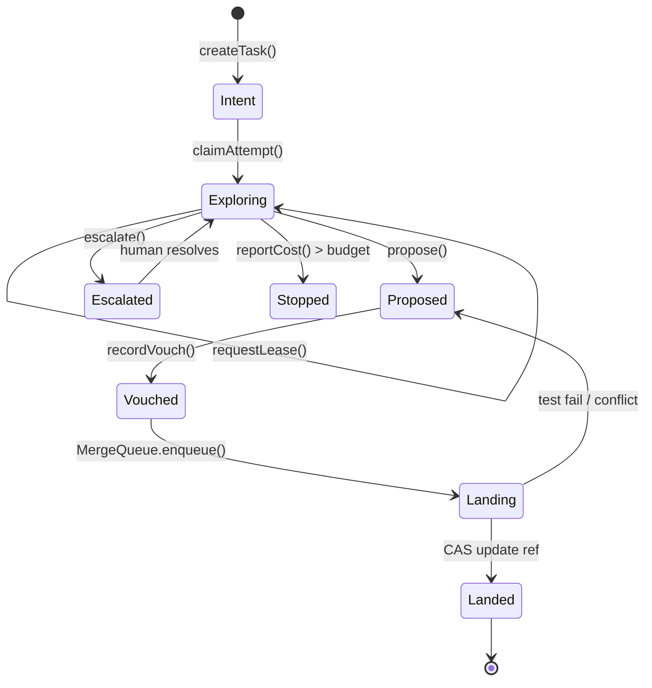

# Reference: SQLite Data Model & State Transitions

> **Diátaxis Mode:** Reference (Information-oriented)  
> **Source of Truth:** [`src/durable-objects/TaskCoordinator.ts`](file:///C:/Users/richa/dev/berth/src/durable-objects/TaskCoordinator.ts) and [`src/durable-objects/MergeQueue.ts`](file:///C:/Users/richa/dev/berth/src/durable-objects/MergeQueue.ts).

---

## 1. TaskCoordinator Durable Object Schema

Every task instance in Berth is coordinated by an isolated Cloudflare Durable Object backed by embedded SQLite (`ctx.storage.sql`).

### `tasks` Table
Represents the task container and budget boundaries.

```sql
CREATE TABLE IF NOT EXISTS tasks (
  task_id TEXT PRIMARY KEY,
  title TEXT NOT NULL,
  intent TEXT NOT NULL,
  status TEXT NOT NULL, -- 'Intent' | 'Exploring' | 'Proposed' | 'Vouched' | 'Landing' | 'Landed' | 'Escalated'
  owner_email TEXT NOT NULL,
  budget_usd REAL NOT NULL DEFAULT 5.0,
  spent_usd REAL NOT NULL DEFAULT 0.0,
  max_tokens INTEGER NOT NULL DEFAULT 500000,
  created_at INTEGER NOT NULL,
  updated_at INTEGER NOT NULL
);
```

### `attempts` Table
Tracks competing agent runs racing on the task.

```sql
CREATE TABLE IF NOT EXISTS attempts (
  attempt_id TEXT PRIMARY KEY,
  task_id TEXT NOT NULL,
  agent_id TEXT NOT NULL,
  status TEXT NOT NULL, -- 'running' | 'proposed' | 'stopped_over_budget' | 'discarded' | 'landed'
  fork_repo_name TEXT NOT NULL,
  fork_remote_url TEXT NOT NULL,
  token_id TEXT,
  commit_sha TEXT,
  spent_usd REAL NOT NULL DEFAULT 0.0,
  tokens_in INTEGER NOT NULL DEFAULT 0,
  tokens_out INTEGER NOT NULL DEFAULT 0,
  stop_reason TEXT,
  modified_paths TEXT, -- JSON array of modified paths
  created_at INTEGER NOT NULL,
  updated_at INTEGER NOT NULL,
  FOREIGN KEY (task_id) REFERENCES tasks(task_id)
);
```

### `leases` Table
Mutual exclusion lock table ensuring disjoint paths between racing attempts.

```sql
CREATE TABLE IF NOT EXISTS leases (
  lease_id TEXT PRIMARY KEY,
  task_id TEXT NOT NULL,
  attempt_id TEXT NOT NULL,
  path_pattern TEXT NOT NULL,
  granted_at INTEGER NOT NULL,
  expires_at INTEGER NOT NULL,
  FOREIGN KEY (task_id) REFERENCES tasks(task_id),
  FOREIGN KEY (attempt_id) REFERENCES attempts(attempt_id)
);
```

### `proposals` Table
Candidate changes awaiting human vouching.

```sql
CREATE TABLE IF NOT EXISTS proposals (
  proposal_id TEXT PRIMARY KEY,
  task_id TEXT NOT NULL,
  attempt_id TEXT NOT NULL,
  commit_sha TEXT NOT NULL,
  evidence_ids TEXT NOT NULL, -- JSON array
  summary TEXT NOT NULL,
  created_at INTEGER NOT NULL,
  FOREIGN KEY (task_id) REFERENCES tasks(task_id),
  FOREIGN KEY (attempt_id) REFERENCES attempts(attempt_id)
);
```

### `conflict_matrix` Table
Real-time push collision evaluation across active attempts and trunk.

```sql
CREATE TABLE IF NOT EXISTS conflict_matrix (
  task_id TEXT NOT NULL,
  attempt_a TEXT NOT NULL,
  attempt_b TEXT NOT NULL,
  status TEXT NOT NULL, -- 'clean' | 'conflicting'
  conflicting_files TEXT, -- JSON array
  conflict_details TEXT,
  calculated_at INTEGER NOT NULL,
  PRIMARY KEY (task_id, attempt_a, attempt_b)
);
```

### `decision_logs` Table
Immutable audit trail of coordinator invariant actions.

```sql
CREATE TABLE IF NOT EXISTS decision_logs (
  log_id TEXT PRIMARY KEY,
  task_id TEXT NOT NULL,
  attempt_id TEXT,
  decision TEXT NOT NULL,
  reason TEXT NOT NULL,
  created_at INTEGER NOT NULL
);
```

---

## 2. MergeQueue Durable Object Schema

The singleton `MergeQueue` DO protects trunk (`main`) and executes landing linearizations.

### `merge_queue` Table
FIFO work queue of vouched changes awaiting CAS push.

```sql
CREATE TABLE IF NOT EXISTS merge_queue (
  entry_id TEXT PRIMARY KEY,
  task_id TEXT NOT NULL,
  change_id TEXT NOT NULL,
  attempt_id TEXT NOT NULL,
  commit_sha TEXT NOT NULL,
  vouched_by TEXT NOT NULL,
  status TEXT NOT NULL, -- 'queued' | 'testing' | 'linearizing' | 'landing' | 'landed' | 'failed'
  enqueued_at INTEGER NOT NULL,
  updated_at INTEGER NOT NULL,
  error_message TEXT,
  retry_count INTEGER NOT NULL DEFAULT 0
);
```

### `landing_log` Table
Immutable provenance log of changes landed on trunk.

```sql
CREATE TABLE IF NOT EXISTS landing_log (
  log_id TEXT PRIMARY KEY,
  task_id TEXT NOT NULL,
  change_id TEXT NOT NULL,
  attempt_id TEXT NOT NULL,
  vouched_by TEXT NOT NULL,
  linearized_sha TEXT NOT NULL,
  landed_at INTEGER NOT NULL,
  transit_ms INTEGER NOT NULL
);
```

---

## 3. Task State Lifecycle Machine


